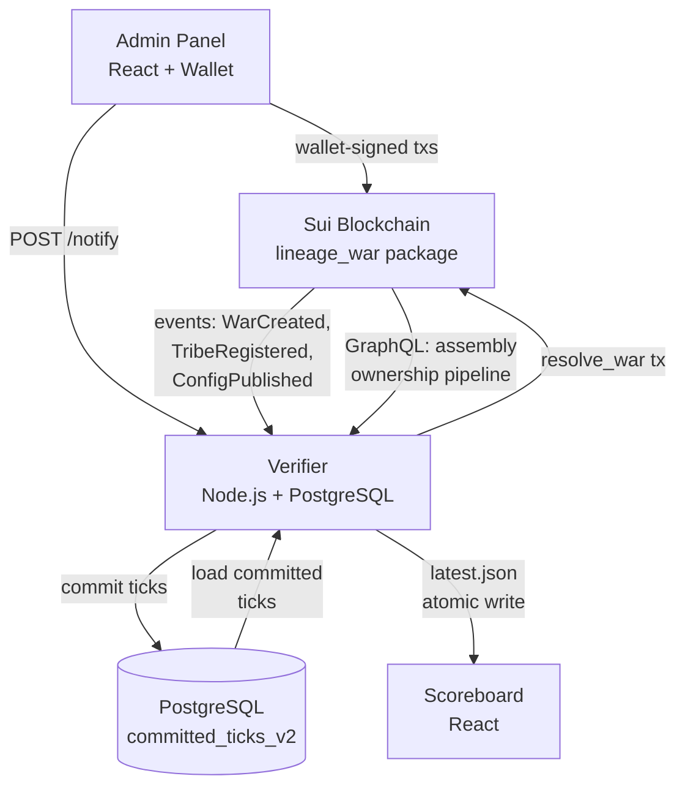

# Lineage War

Competitive territorial control game on Sui for EVE Frontier. Tribes deploy smart assemblies in solar systems to fight for control. An off-chain verifier scores the war continuously, and the result is permanently recorded on chain.

## Architecture



See [LINEAGE_WAR_ARCHITECTURE.md](./LINEAGE_WAR_ARCHITECTURE.md) for the full architecture document.

## Structure

```
lineage-war/
├── contracts/    Move smart contracts (Sui blockchain)
├── verifier/     Scoring engine (Node.js/TypeScript)
├── admin/        War admin panel (React)
├── scoreboard/   Live scoreboard (React)
└── prehype/      Pre-war activation & countdown
```

## Quick Start

```bash
# Verifier
cd verifier && npm install && cp .env.example .env
# Edit .env with your Sui RPC, package ID, and admin key
npm start

# Admin panel (dev)
cd admin && npm install && npm run dev

# Scoreboard (dev)
cd scoreboard && npm install && npm run dev
```

## Deployment Notes

The scoreboard reads `VITE_PREDICTION_MARKET_URL` and `VITE_AIRDROP_URL` at build time for the top-header external links. On Railway, set:

```bash
VITE_PREDICTION_MARKET_URL=https://orchestrator.lineagewar.xyz
VITE_AIRDROP_URL=https://orchestrator.lineagewar.xyz/airdrop
```

Because they are Vite build-time variables, changing them requires a rebuild/redeploy before the live scoreboard bundle updates.

## Contributions Welcome

The on-chain contracts and verifier support N tribes and long-running wars. We'd love collaboration on:

**Multi-tribe scoreboard** — The scoreboard frontend is currently designed for 2-tribe wars. The contracts and verifier handle N tribes. The frontend needs work for 3+ tribes: color assignment, layout scaling, chart readability. Good first contribution.

**GraphQL degraded mode** — The verifier retries GraphQL ownership resolution up to five times with backoff. If GraphQL still fails, it freezes the whole tick by carrying forward the last resolved state and persists that tick as degraded. This is intentional behavior; degraded ticks are not automatically rewritten later when GraphQL recovers.

See [CONTRIBUTING.md](./CONTRIBUTING.md) for setup and guidelines.

## License

MIT — see [LICENSE](./LICENSE)
