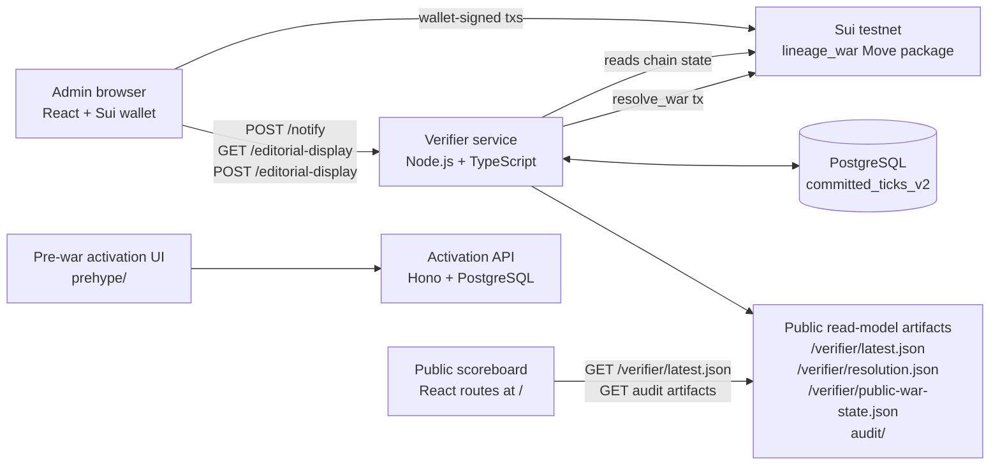

# Lineage War

Lineage War is a Sui-backed territorial control event stack for EVE Frontier. This repository combines the on-chain Move package, the off-chain verifier that scores wars continuously, the operator admin UI, the public scoreboard, and the pre-war activation surfaces.

## What Lives In This Repo

- `contracts/`: Move modules for war lifecycle, configuration, scoring rules, and final resolution objects.
- `verifier/`: Node.js service that discovers wars from chain events, resolves ticks, writes public artifacts, and serves the built frontends.
- `admin/`: React operator UI served by the verifier at `/admin/`.
- `scoreboard/`: React public UI served by the verifier at `/`, including audit and system drilldown routes.
- `api/`: Canonical activation API for the pre-war registration and countdown flow.
- `prehype/`: Pre-war waiting-page UI and related assets. `prehype/api/` currently mirrors the activation API and should be treated as legacy until that duplication is removed.

## High-Level Architecture



The verifier is the operational center of the live war loop. It discovers wars from Sui events, resolves ticks, commits the durable ledger to PostgreSQL, writes public artifacts, and submits the final on-chain resolution when a war ends.

## What Is Live Today

- Chain-discovered war lifecycle on Sui: create, register tribes, publish phases, schedule end, and resolve.
- Verifier-backed scoring with PostgreSQL durability and atomic public artifacts.
- Operator workflows in the admin panel, including editorial display publish and readback.
- Public scoreboard and audit surfaces backed by `/verifier/latest.json`.
- Sticky ended-war handling so the public site does not drop to an empty state between wars.

## Choose Your Path

- Move and Sui review: start with `contracts/sources/`, then [WAR_SYSTEM_SPEC.md](./WAR_SYSTEM_SPEC.md).
- Runtime and infrastructure review: start with `verifier/src/live-chain-loop.ts`, then [LINEAGE_WAR_ARCHITECTURE.md](./LINEAGE_WAR_ARCHITECTURE.md).
- Frontend review: start with `admin/src/` and `scoreboard/src/`.
- Pre-war activation work: use top-level `api/` as the active service entrypoint; treat `prehype/api/` as a duplicated legacy mirror for now.

## Live Interfaces

- `GET /status` for runtime diagnostics and current-war state
- `POST /notify` as a trigger that wakes verifier rediscovery after admin changes; it does not publish authoritative state by itself
- `GET /editorial-display?warId=<id>` and `POST /editorial-display` for operator/editorial system display copy
- `/verifier/latest.json`, `/verifier/resolution.json`, and sibling audit artifacts as the public read-model artifacts

## Quick Start

### Core war loop

```bash
cd verifier
npm install
cp .env.example .env
# Fill in the required Sui, PostgreSQL, and admin-key values.
npm run check
npm run build
npm start
```

In separate terminals:

```bash
cd admin
npm install
npm run dev

cd ../scoreboard
npm install
npm run dev
```

### Optional activation stack

```bash
cd api
npm install
npm run dev
```

`api/` is the active activation service. `prehype/api/` currently mirrors that code and should be treated as legacy until the repo is consolidated.

### Scoreboard deployment note

`VITE_PREDICTION_MARKET_URL` and `VITE_AIRDROP_URL` are Vite build-time variables. Changing either requires a rebuild of the scoreboard bundle before the public header updates.

## Current Tradeoffs

The canonical list of live limitations and operational tradeoffs lives in [LINEAGE_WAR_ARCHITECTURE.md](./LINEAGE_WAR_ARCHITECTURE.md#8-known-limitations). That is the version this repo intends to keep current.

## Further Reading

- [LINEAGE_WAR_ARCHITECTURE.md](./LINEAGE_WAR_ARCHITECTURE.md): runtime topology, interfaces, artifacts, and known limitations
- [WAR_SYSTEM_SPEC.md](./WAR_SYSTEM_SPEC.md): war semantics, scoring lifecycle, and resolution rules
- [contracts/README.md](./contracts/README.md): Move module guide and build notes
- [CONTRIBUTING.md](./CONTRIBUTING.md): contributor entry points, help-wanted areas, and validation expectations

## License

MIT. See [LICENSE](./LICENSE).
