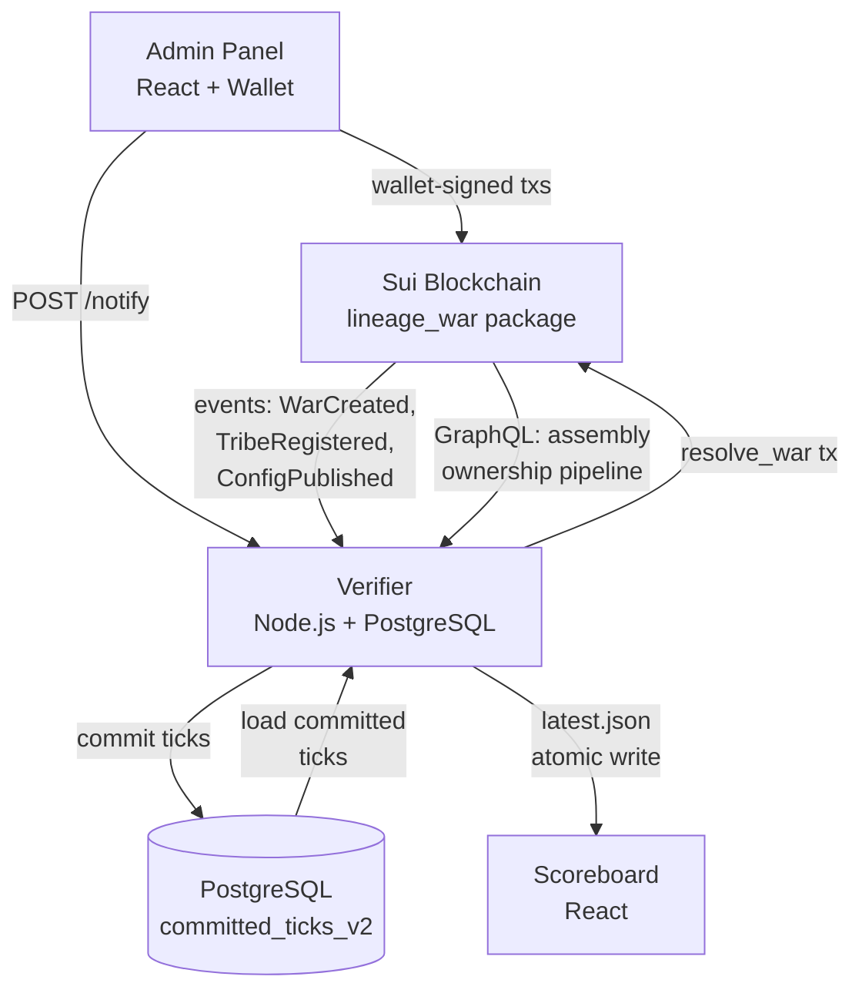

# Lineage War

Competitive territorial control game on Sui for EVE Frontier. Tribes deploy smart assemblies in solar systems to fight for control. An off-chain verifier scores the war continuously, and the result is permanently recorded on chain.

## Architecture



See [LINEAGE_WAR_ARCHITECTURE.md](./LINEAGE_WAR_ARCHITECTURE.md) for the full architecture document.

## Structure

```
lineage-war/
├── contracts/    Move smart contracts (Sui blockchain)
├── verifier/     Scoring engine (Node.js/TypeScript)
├── admin/        War admin panel (React)
├── scoreboard/   Live scoreboard (React)
└── prehype/      Pre-war activation & countdown
```

## Quick Start

```bash
# Verifier
cd verifier && npm install && cp .env.example .env
# Edit .env with your Sui RPC, package ID, and admin key
npm start

# Admin panel (dev)
cd admin && npm install && npm run dev

# Scoreboard (dev)
cd scoreboard && npm install && npm run dev
```

## Contributions Welcome

The on-chain contracts and verifier support N tribes and long-running wars. We'd love collaboration on:

**Multi-tribe scoreboard** — The scoreboard frontend is currently designed for 2-tribe wars. The contracts and verifier handle N tribes. The frontend needs work for 3+ tribes: color assignment, layout scaling, chart readability. Good first contribution.

**GraphQL batch optimization** — After long verifier downtime (days), catch-up resolves all missed ticks at once, generating thousands of GraphQL calls with no rate-limit backoff. A batching/throttling layer for the GraphQL ownership pipeline would make long-war recovery more resilient.

See [CONTRIBUTING.md](./CONTRIBUTING.md) for setup and guidelines.

## License

MIT — see [LICENSE](./LICENSE)
